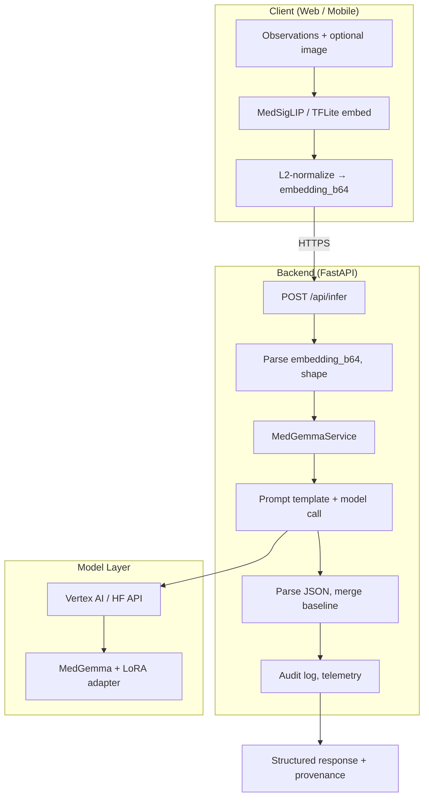
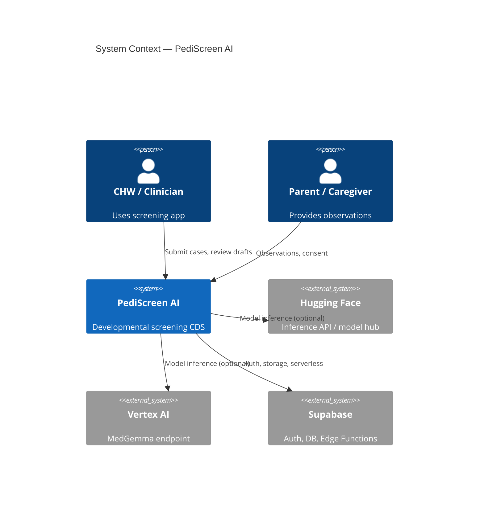
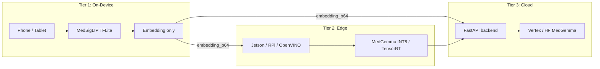
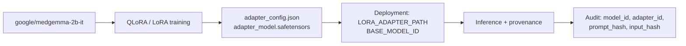
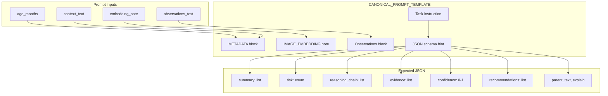
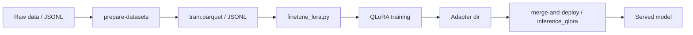
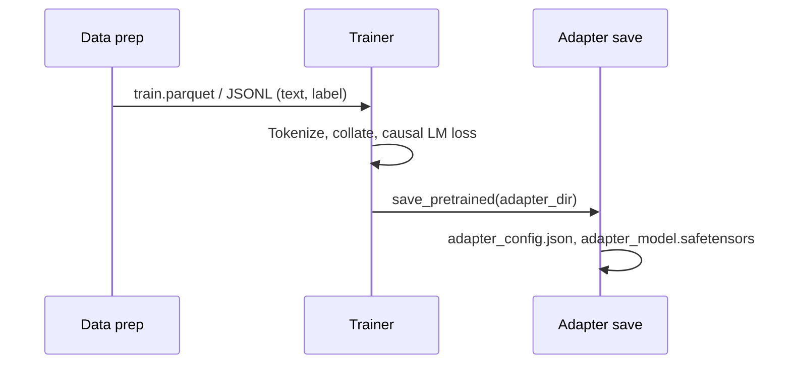
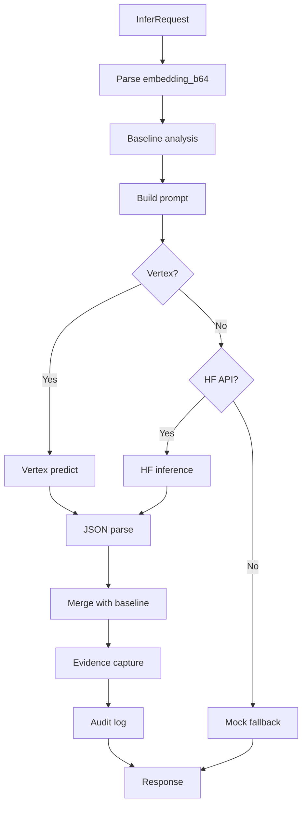
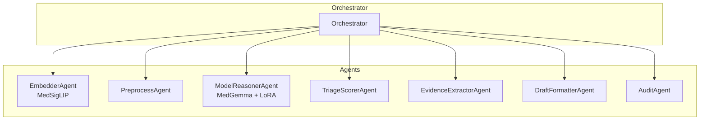

# PediScreen AI — Technical Reference

**Super-technical README: MedGemma-based developmental screening platform.**

[](https://opensource.org/licenses/Apache-2.0)

---

## Table of Contents

1. [Executive Summary & MedGemma Focus](#1-executive-summary--medgemma-focus)
2. [System Architecture Overview](#2-system-architecture-overview)
3. [MedGemma Model Lineage & Provenance](#3-medgemma-model-lineage--provenance)
4. [Model Architecture (Base + PEFT)](#4-model-architecture-base--peft)
5. [Training Pipeline (QLoRA / LoRA)](#5-training-pipeline-qlora--lora)
6. [Inference Pipeline & Data Flow](#6-inference-pipeline--data-flow)
7. [Multi-Agent (HAI-DEF) Architecture](#7-multi-agent-hai-def-architecture)
8. [API Contracts & Embedding Protocol](#8-api-contracts--embedding-protocol)
9. [Privacy, PHI & Embedding-First Design](#9-privacy-phi--embedding-first-design)
10. [Human-in-the-Loop, Safety & Audit](#10-human-in-the-loop-safety--audit)
11. [Edge & On-Device Deployment](#11-edge--on-device-deployment)
12. [Repository Structure & Key Paths](#12-repository-structure--key-paths)
13. [Configuration & Environment](#13-configuration--environment)
14. [Quick Start & Runbooks](#14-quick-start--runbooks)
15. [References & Further Reading](#15-references--further-reading)
16. [Troubleshooting & Performance](#16-troubleshooting--performance)

---

## 1. Executive Summary & MedGemma Focus

PediScreen AI is a **clinical decision support (CDS)** platform for pediatric developmental screening (ages 0–5). It is built on **Google’s MedGemma** foundation models (HAI-DEF suite) and uses **parameter-efficient fine-tuning (PEFT)**—specifically **LoRA** and **QLoRA**—to adapt MedGemma for developmental milestone reasoning, risk stratification, and evidence-grounded summarization without training from scratch.

### 1.1 Why MedGemma

- **Medical foundation:** Pre-trained on broad biomedical corpora; suitable for clinical-style reasoning and safe, constrained outputs.
- **Scale options:** Available in 2B and 4B parameter variants (`google/medgemma-2b-it`, `google/medgemma-4b-it`), enabling trade-offs between latency, cost, and accuracy.
- **Multimodal readiness:** Vision-language capable; supports fusion of text observations with image-derived embeddings (e.g. MedSigLIP) for drawing/activity analysis.
- **On-device / edge:** Smaller variants and quantized (INT8/4-bit) deployments support offline and edge scenarios (Jetson, LiteRT/TFLite, OpenVINO).

### 1.2 Core Technical Claims

| Area | Approach |
|------|----------|
| **Base model** | `google/medgemma-2b-it` (primary) or `google/medgemma-4b-it` |
| **Adaptation** | LoRA/QLoRA on attention + MLP projections; rank 8–16, alpha 16–32 |
| **Inference** | Embedding-first: client sends L2-normalized image embedding; raw pixels never leave device |
| **Backend** | FastAPI; Vertex AI and/or Hugging Face Inference API; optional Redis cache |
| **Output** | Structured JSON (summary, risk, recommendations, reasoning_chain, evidence, confidence) with provenance |

---

## 2. System Architecture Overview

High-level flow: **Client** → **Embedding (on-device or server)** → **Backend API** → **MedGemma (Vertex/HF or local)** → **MCP tools (optional)** → **Calibration & audit** → **Response**.



### 2.1 Component Diagram



### 2.2 Deployment Tiers



---

## 3. MedGemma Model Lineage & Provenance

PediScreen implements **model tracing** for the MedGemma Impact Challenge: provenance and weight trace from base model to deployed adapter.

### 3.1 Provenance Trace

| Field | Value |
|-------|--------|
| **Base model ID** | `google/medgemma-2b-it` (or `google/medgemma-4b-it`) |
| **Lineage** | Direct descendant of MedGemma instruction-tuned foundation model |
| **Modification** | LoRA/QLoRA PEFT for pediatric developmental screening |
| **Training data** | Synthetic developmental scenarios from CDC milestones + ASQ-3; CHW feedback where available |

### 3.2 Weight Trace (Architecture & Recipe)

| Item | Specification |
|------|----------------|
| **Architecture** | MedGemma (Gemma-2-2B-it with vision-language components) |
| **PEFT** | LoRA (Low-Rank Adaptation) or QLoRA (4-bit quantized base) |
| **Target modules** | `q_proj`, `k_proj`, `v_proj`, `o_proj`, `gate_proj`, `up_proj`, `down_proj` |
| **Rank (r)** | 8 (2B) or 16 (4B) |
| **Alpha** | 16–32 |
| **Dropout** | 0.05 |
| **Quantization (QLoRA)** | 4-bit NF4, bfloat16 compute, double quant |

### 3.3 Traceability Diagram



Model card and artifacts: **[model/README.md](model/README.md)**.

---

## 4. Model Architecture (Base + PEFT)

### 4.1 MedGemma Base

MedGemma is part of the HAI-DEF suite: Gemma-2-based causal LM with medical pretraining and optional vision encoder/connector. For PediScreen we use the **instruction-tuned** variants (`-it`) and feed them structured prompts; image input is handled via **precomputed embeddings** (no raw pixels to the LLM in production).

- **Tokenizer:** Same as base Gemma-2; chat template supported.
- **Causal LM:** Autoregressive generation with configurable `max_new_tokens`, `temperature`, and `do_sample`.

### 4.2 LoRA / QLoRA Attachment

```mermaid
flowchart TB
    subgraph Base["Base MedGemma (frozen)"]
        Q[q_proj] K[k_proj] V[v_proj] O[o_proj]
        G[gate_proj] U[up_proj] D[down_proj]
    end

    subgraph LoRA["LoRA adapters (trainable)"]
        LQ[Δq] LK[Δk] LV[Δv] LO[Δo]
        LG[Δgate] LU[Δup] LD[Δdown]
    end

    Q --> LQ
    K --> LK
    V --> LV
    O --> LO
    G --> LG
    U --> LU
    D --> LD
```

- **Forward:** `output = W_base @ x + (B @ A) @ x` where LoRA adds low-rank `B (d×r)`, `A (r×k)`.
- **Inference:** Base loaded in 4-bit (QLoRA) or bfloat16; adapter merged or applied on the fly.

### 4.3 Prompt Template (Canonical)

The backend uses a single canonical prompt template (see `MedGemmaService._build_synthesis_prompt` and `CANONICAL_PROMPT_TEMPLATE` in `backend/app/services/medgemma_service.py`):

- **Inputs:** `age_months`, `context_text`, `embedding_note`, `observations_text`.
- **Output:** JSON between `===BEGIN_OUTPUT===` and `===END_OUTPUT===` with keys: `summary`, `risk`, `reasoning_chain`, `evidence`, `confidence`, `recommendations`, `parent_text`, `explain`.

Parsing supports delimiter extraction and fallback to first `{ ... }` block with normalization (e.g. risk coerced to `low`|`monitor`|`high`|`refer`).

### 4.4 Canonical Prompt Structure (Diagram)



### 4.5 Generation Parameters

- **temperature:** 0.0–0.2 for deterministic screening outputs.
- **max_new_tokens:** 256–512 (configurable in service and inference scripts).
- **do_sample:** Typically False for reproducible CDS drafts.
- **pad_token_id:** Set to `tokenizer.pad_token_id` or `tokenizer.eos_token_id` for generation.

---

## 5. Training Pipeline (QLoRA / LoRA)

### 5.1 Pipeline Overview



- **Data:** Parquet or JSONL with `text` column (and optional `label`); SFT format (instruction + response).
- **Scripts:** `training/finetune_lora.py`, `training/inference_qlora.py`; optional `training/prepare_sft_data.py`, `training/feedback-processor.py` for CHW feedback.
- **Config:** `training/lora_config.yaml` (r, alpha, target_modules, quantization); CLI overrides for `--lora_rank`, `--lora_alpha`, `--attention-only`.

### 5.2 Training Configuration (Reference)

From `training/lora_config.yaml` and `training/finetune_lora.py`:

| Parameter | 2B typical | 4B typical |
|-----------|------------|------------|
| Base | `google/medgemma-2b-it` | `google/medgemma-4b-it` |
| LoRA r | 8 | 16 |
| LoRA alpha | 16–32 | 16 |
| LoRA dropout | 0.05 | 0.05 |
| Target modules | q,k,v,o,gate,up,down | same; or attention-only for VRAM |
| Quantization | 4-bit NF4, bfloat16, double quant | same |
| Batch size (per device) | 2–8 | 2 |
| Gradient accumulation | 4–8 | 8 |
| Epochs | 3 | 3 |
| Learning rate | 2e-4 – 5e-5 | 5e-5 |

Run from repo root: `bash scripts/run-pediscreen-training.sh` (see AGENTS.md). Full pipeline doc: **docs/CURSOR_PROMPT_PEDISCREEN_TRAINING_PIPELINE.md**.

### 5.3 Training Data Flow



---

## 6. Inference Pipeline & Data Flow

### 6.1 End-to-End Inference Sequence

```mermaid
sequenceDiagram
    participant C as Client
    participant API as POST /api/infer
    participant Svc as MedGemmaService
    participant M as Vertex / HF
    participant Audit as Audit

    C->>API: InferRequest(case_id, age_months, observations, embedding_b64, shape, emb_version)
    API->>API: Parse embedding_b64, validate shape
    API->>Svc: infer_with_precomputed_embedding(...)
    Svc->>Svc: _baseline_analysis (deterministic)
    Svc->>Svc: _build_synthesis_prompt (canonical template)
    Svc->>M: _call_vertex_text or _call_hf_inference(prompt)
    M-->>Svc: model_raw (text)
    Svc->>Svc: _parse_model_json (===BEGIN_OUTPUT=== ... ===END_OUTPUT===)
    Svc->>Svc: Merge model_parsed + baseline; evidence capture
    Svc-->>API: result + provenance
    API->>Audit: log_inference_audit, write_audit, emit_ai_event
    API-->>C: 200 + result, provenance, inference_time_ms
```

### 6.2 HAI Pipeline (Optional)

When `USE_HAI_PIPELINE=true` and `USE_AGENT_PIPELINE=true`, the infer endpoint delegates to an **inference controller** that:

1. Uses a **model registry** (`MODEL_BACKEND=medgemma|mock`).
2. Runs **MedGemmaModel** (wrapper around MedGemmaService) with deterministic temperature and prompt versioning.
3. Optionally runs **MCP tools** (milestone, risk, guideline, confidence, audit).
4. Applies **post-processing** (validation, safety) and **calibration** (confidence bounds, `requires_clinician_review`).
5. Writes **expanded audit** (model_id, adapter_id, prompt_version, tool_chain, confidence).

See **docs/model_architecture.md** for the pipeline diagram and component list.

### 6.3 Inference Flow Diagram



---

## 7. Multi-Agent (HAI-DEF) Architecture

PediScreen can run **HAI-DEF models as callable agents** (Embedder, ModelReasoner, TriageScorer, etc.) with a central orchestrator.

### 7.1 Agent Topology



- **EmbedderAgent:** MedSigLIP (local/Vertex/HF); outputs `embedding_b64`, `shape`, `emb_version`.
- **ModelReasonerAgent:** MedGemma + adapter; outputs draft summary, risk, evidence, confidence.
- **TriageScorerAgent:** Business rules; outputs triage_score, recommended_action.
- **AuditAgent:** Append-only audit store.

Contract: `POST /call` with `request_id`, `case_id`, `consent`, `payload`, `meta`; response includes `output`, `diagnostics`, `provenance`. See **docs/CURSOR_PROMPT_SPECIALIZED_MULTI_AI_AGENTS.md**.

### 7.2 Orchestrate API

When the frontend uses the agentic UI and provides `embedding_b64`, it can call **orchestrateCase()** (e.g. `POST /api/orchestrate/case`). The backend runs the full HAI-DEF workflow and returns an **AgentCallResponse** (output, diagnostics, provenance). Frontend hook: `src/hooks/useAgentOrchestrator.ts`; API: `src/api/medgemma.ts` → `orchestrateCase()`.

---

## 8. API Contracts & Embedding Protocol

### 8.1 POST /api/infer

**Request (InferRequest):**

```json
{
  "case_id": "unique-case-id",
  "age_months": 24,
  "observations": "Caregiver observations text",
  "embedding_b64": "<base64-encoded float32 bytes>",
  "shape": [1, 256],
  "emb_version": "medsiglip-v1",
  "consent_id": "optional-consent-id",
  "user_id_pseudonym": "optional-pseudonym"
}
```

**Response (200):**

- `case_id`, `result` (summary, risk, recommendations, parent_text, explain, confidence, evidence, reasoning_chain, model_provenance), `provenance`, `inference_time_ms`, optional `fallback_used`, `inference_id`, `feedback_allowed`, `feedback_url`.

**Errors:**

- 400 `EMBEDDING_PARSE_ERROR`: invalid `embedding_b64` or shape mismatch.
- 422 validation error.
- 500 `INFERENCE_FAILED`, 503 `MODEL_LOAD_FAIL`.

**Embedding contract:** Base64-encoded raw float32 bytes; length must equal `prod(shape)*4`. Client should L2-normalize before encoding. Typical shape `[1, 256]` for MedSigLIP.

**Full response schema (result):**

| Field | Type | Description |
|-------|------|-------------|
| `summary` | string[] | Short clinical summary bullets |
| `risk` | "low" \| "monitor" \| "high" \| "refer" | Risk level |
| `recommendations` | string[] | Actionable recommendations |
| `parent_text` | string | Plain-language summary for caregiver |
| `explain` | string | Explanation / narrative |
| `confidence` | number | 0.0–1.0 |
| `evidence` | object[] | type, description, reference_ids, influence |
| `reasoning_chain` | string[] | Step-by-step reasoning |
| `model_provenance` | object | adapter_id, model_id, prompt_hash, input_hash, emb_version |

**Provenance (top-level):** `case_id`, `input_hash`, `prompt_hash`, `base_model_id`, `adapter_id`, `emb_version`, `inference_time_ms`, `used_vertex`, optional `user_id_pseudonym`, `consent_id`.

See **docs/api.md** for full spec.

### 8.2 Embedding Pipeline (Server-Side)

If the client sends raw image bytes (e.g. `analyze_input`), the server can compute embeddings via:

1. Local MedSigLIP (`MEDSIGLIP_ENABLE_LOCAL`)
2. MedSigLIP on Vertex
3. MedSigLIP on Hugging Face
4. Generic Vertex Vision endpoint
5. HF vision fallback

Result: `(embedding, visual_summary)`; optional Redis cache by image hash.

---

## 9. Privacy, PHI & Embedding-First Design

### 9.1 Embedding-First Principle

- **Raw images never leave the device** in the primary flow: client runs MedSigLIP (or equivalent) on-device, L2-normalizes, and sends only `embedding_b64` to `POST /api/infer`.
- Server-side analysis uses only the embedding and text observations; no pixel data is stored or sent to third-party model APIs in this path.

### 9.2 PHI Detection

- `MedGemmaService._detect_phi(observations)` uses conservative heuristics (email, SSN-like, MRN, date patterns). If PHI is detected and `ALLOW_PHI` is False, the server **refuses to send to external model** and returns a **baseline analysis only** with provenance `phi_blocked`.

### 9.3 Client-Side Encryption (Optional)

- For additional protection, embeddings can be encrypted with the server’s Curve25519 public key; server decrypts with `SERVER_PRIVATE_KEY_B64`. Key generation: `app/backend/gen_keypair.py`. See README “Privacy & Security” section for usage.

---

## 10. Human-in-the-Loop, Safety & Audit

### 10.1 HITL Guarantees

- All AI outputs are **draft**; **licensed clinicians** remain the authority at every critical decision.
- State machine: `REQUIRES_REVIEW` → clinician review/edit → `SIGNED_OFF` before sharing with families.
- Safety agents can flag overreach or uncertainty and force mandatory human review.

### 10.2 Inference Failsafe

- Model timeout or invalid JSON → structured fallback: `risk: manual_review_required`, `fallback: true`.
- Low confidence (e.g. <0.6) → `requires_clinician_review: true`.
- All fallback events are logged in the audit trail.

### 10.3 Audit Fields

- Request/case IDs, `model_id`, `adapter_id`, `prompt_version`, `tool_chain`, `confidence`, `clinician_override`, `input_hash`, `prompt_hash`, `inference_time_ms`. See `log_inference_audit`, `write_audit`, and telemetry `emit_ai_event` in `backend/app/api/infer.py`.

---

## 11. Edge & On-Device Deployment

### 11.1 Jetson (NVIDIA)

- **Purpose:** High-performance embedded AI (e.g. Orin Nano 8GB) for clinic or mobile CHW units.
- **Stack:** JetPack 6, TensorRT-LLM; MedGemma-2B INT8; ~1.7 s/screening, 18–24 screenings/hour.
- **Paths:** `edge/jetson/`, `docs/JETSON_EDGE_DEPLOYMENT.md` (if present).

### 11.2 LiteRT (TensorFlow Lite)

- **Purpose:** On-device TFLite models; MedGemma conversion target INT8, ~91% accuracy target.
- **Paths:** `model-dev/litert/convert_medgemma_to_litert.py`, `docs/LITERT_EDGE_DEPLOYMENT.md` (if present).
- **Coral EdgeTPU:** MoveNet Infant on RPi (~18ms). iOS: `mobile/ios/LiteRTNeuralEngine.swift`.

### 11.3 OpenVINO (Intel)

- **Purpose:** Pose/motor and cry detection on Intel CPU/GPU/NPU/VPU; INT8 IR, ~3x speedup, ~50% size reduction.
- **Backend:** `OPENVINO_ENABLED=true`, `OPENVINO_POSE_IR_PATH`, `OPENVINO_CRY_IR_PATH`; APIs `POST /api/openvino/motor`, `POST /api/openvino/cry`.
- **Doc:** `docs/OPENVINO_INTEGRATION.md` (if present).

### 11.4 Federated Learning

- Flower clients train MedGemma LoRA locally; server aggregates (FedAvg) with differential privacy (ε=1.0). No raw data leaves devices.
- Paths: `training/federated/client.py`, `training/federated/server.py`, `training/federated/config.py`. See `docs/FEDERATED_LEARNING.md` (if present).

---

## 12. Repository Structure & Key Paths

### 12.1 MedGemma & Model

| Role | Path |
|------|------|
| Model card & trace | `model/README.md` |
| LoRA fine-tuning (2B/4B) | `training/finetune_lora.py`, `model/finetuning/finetune_pediscreen.py` |
| QLoRA config | `training/lora_config.yaml` |
| Inference with adapter | `training/inference_qlora.py` |
| MedGemma service | `backend/app/services/medgemma_service.py` |
| MedGemma model wrapper | `backend/app/models/medgemma_model.py` |
| Inference engine (pedi_screen) | `pedi_screen/medgemma_core/inference_engine.py` |

### 12.2 API & Backend

| Role | Path |
|------|------|
| Infer endpoint | `backend/app/api/infer.py` |
| Config | `backend/app/core/config.py` |
| Audit | `backend/app/services/audit.py` |
| Safe inference guardrail | `backend/app/services/safe_inference.py` |

### 12.3 Frontend & Orchestration

| Role | Path |
|------|------|
| Orchestrate / infer client | `src/api/medgemma.ts` |
| Agent orchestrator hook | `src/hooks/useAgentOrchestrator.ts` |
| Types | `src/types/medgemma.ts` |

### 12.4 Lovable / Supabase

- Root `src/`, `index.html`, `vite.config.mjs`, `package.json` are canonical for Lovable build. Supabase: `supabase/functions/` (e.g. `analyze`, `list_screenings`, `health`). See **REPO_STRUCTURE.md** and **docs/RUNBOOK_LOVABLE.md**.

---

## 13. Configuration & Environment

### 13.1 Backend (MedGemma)

| Variable | Purpose |
|----------|---------|
| `HF_MODEL` | Hugging Face model id (e.g. `google/medgemma-2b-it`) |
| `HF_API_KEY` | Hugging Face API token |
| `VERTEX_PROJECT`, `VERTEX_LOCATION` | Vertex AI project and region |
| `VERTEX_TEXT_ENDPOINT_ID`, `VERTEX_VISION_ENDPOINT_ID` | Deployed endpoint IDs |
| `LORA_ADAPTER_PATH` | Path or GCS URI to LoRA adapter |
| `BASE_MODEL_ID` | e.g. `google/medgemma-2b-it` (provenance) |
| `ALLOW_PHI` | If False, PHI detection blocks external call |
| `REDIS_URL` | Optional cache for embeddings |
| `MOCK_FALLBACK` | If True, return mock when model not configured |
| `USE_HAI_PIPELINE`, `USE_AGENT_PIPELINE` | Enable HAI inference controller and agents |

### 13.2 Frontend

| Variable | Purpose |
|----------|---------|
| `VITE_SUPABASE_URL`, `VITE_SUPABASE_ANON_KEY` | Supabase project |
| `VITE_*` | Any other frontend env (see `.env.example`) |

---

## 14. Quick Start & Runbooks

### 14.1 Local Backend + Frontend

```bash
# Backend (port 8000)
cp .env.example .env
cd backend && pip install -r requirements.txt
uvicorn app.main:app --host 0.0.0.0 --port 8000

# Frontend (port 8080)
npm install && npm run dev
# Open http://localhost:8080/pediscreen
```

- **Demo vs live:** `MOCK_MODE=true` (default) uses mock data without MedGemma. Set `HF_MODEL` and `HF_API_KEY` (or Vertex) for live inference.

### 14.2 Infer with cURL

```bash
curl -X POST http://localhost:8000/api/infer \
  -H "Content-Type: application/json" \
  -H "X-API-Key: dev-example-key" \
  -d '{"case_id":"test-1","age_months":24,"observations":"Parent reports few words","embedding_b64":"<base64-float32-bytes>","shape":[1,256]}'
```

### 14.3 Training (QLoRA)

```bash
python training/finetune_lora.py --model_name_or_path google/medgemma-2b-it \
  --train_file data/synth_train.jsonl --output-dir outputs/pediscreen-2b-qlora \
  --lora_rank 8 --lora_alpha 32 --num_train_epochs 3
```

### 14.4 Runbooks

- **Lovable / Supabase:** [docs/RUNBOOK_LOVABLE.md](docs/RUNBOOK_LOVABLE.md)
- **Inference failure, audit, recovery:** [RUNBOOK.md](RUNBOOK.md)

---

## 15. References & Further Reading

### 15.1 Internal Docs

- **Agent & repo layout:** [AGENTS.md](AGENTS.md)
- **Repo structure (Lovable-critical paths):** [REPO_STRUCTURE.md](REPO_STRUCTURE.md)
- **Model card & tracing:** [model/README.md](model/README.md)
- **API spec:** [docs/api.md](docs/api.md)
- **Model architecture (HAI + MCP):** [docs/model_architecture.md](docs/model_architecture.md)
- **Multi-agent spec:** [docs/CURSOR_PROMPT_SPECIALIZED_MULTI_AI_AGENTS.md](docs/CURSOR_PROMPT_SPECIALIZED_MULTI_AI_AGENTS.md)
- **Training pipeline (Kaggle Gold):** [docs/CURSOR_PROMPT_PEDISCREEN_TRAINING_PIPELINE.md](docs/CURSOR_PROMPT_PEDISCREEN_TRAINING_PIPELINE.md)
- **Kaggle deployment:** [docs/CURSOR_PROMPT_KAGGLE_PEDISCREEN_FINAL.md](docs/CURSOR_PROMPT_KAGGLE_PEDISCREEN_FINAL.md)

### 15.2 External

- **MedGemma (Google):** Hugging Face `google/medgemma-2b-it`, `google/medgemma-4b-it`
- **HAI-DEF:** Google’s Health AI DEF (foundation models for healthcare)
- **LoRA:** Hu et al., “LoRA: Low-Rank Adaptation of Large Language Models”
- **QLoRA:** Dettmers et al., “QLoRA: Efficient Finetuning of Quantized LLMs”

---

## License

Apache 2.0. See [LICENSE](LICENSE).

---

---

## 16. Troubleshooting & Performance

### 16.1 Common Issues

| Symptom | Cause | Fix |
|--------|--------|-----|
| 503 MODEL_LOAD_FAIL | No HF/Vertex config | Set `HF_MODEL`+`HF_API_KEY` or `VERTEX_*`; or set `MOCK_FALLBACK=true` for demos |
| 400 EMBEDDING_PARSE_ERROR | Shape/length mismatch | Ensure `len(base64.b64decode(embedding_b64)) == prod(shape)*4` (float32 = 4 bytes per element) |
| PHI blocked / baseline only | PHI detected, ALLOW_PHI=False | Redact observations or use pseudonymized text; do not enable ALLOW_PHI for production without policy |
| JSON parse failure | Model output not in schema | Check `===BEGIN_OUTPUT===`/`===END_OUTPUT===`; fallback parser uses first `{...}`; validate risk enum |
| Slow inference | Large model or network | Use 2B + LoRA; enable Redis for embedding cache; consider edge (Jetson/TensorRT) for latency |

### 16.2 Performance Tuning

- **Latency:** Prefer `google/medgemma-2b-it` + LoRA; 4-bit inference (QLoRA load); Vertex/HF region close to backend; optional response streaming if supported.
- **Throughput:** Batch requests where applicable; scale backend horizontally; use async MedGemmaService (already async in code).
- **Cost:** Cache embeddings (Redis) to avoid re-encoding; use smaller adapter (attention-only LoRA) if full MLP LoRA is not needed.

### 16.3 Observability

- **Audit:** Every inference logs to `log_inference_audit` and optional `write_audit`; includes `request_id`, `case_id`, `model_id`, `adapter_id`, `emb_version`, `success`, `fallback_used`.
- **Telemetry:** `emit_ai_event` sends AI event envelope (endpoint, model_name, org_id, latency_ms, success, fallback_used, provenance). Integrate with your metrics/APM (e.g. Grafana dashboards in `grafana/`).

---

*This README is a technical reference focused on MedGemma integration, architecture, training, inference, and deployment. For product overview, workflow efficiency, and legal/compliance, see the original README sections and linked docs.*
