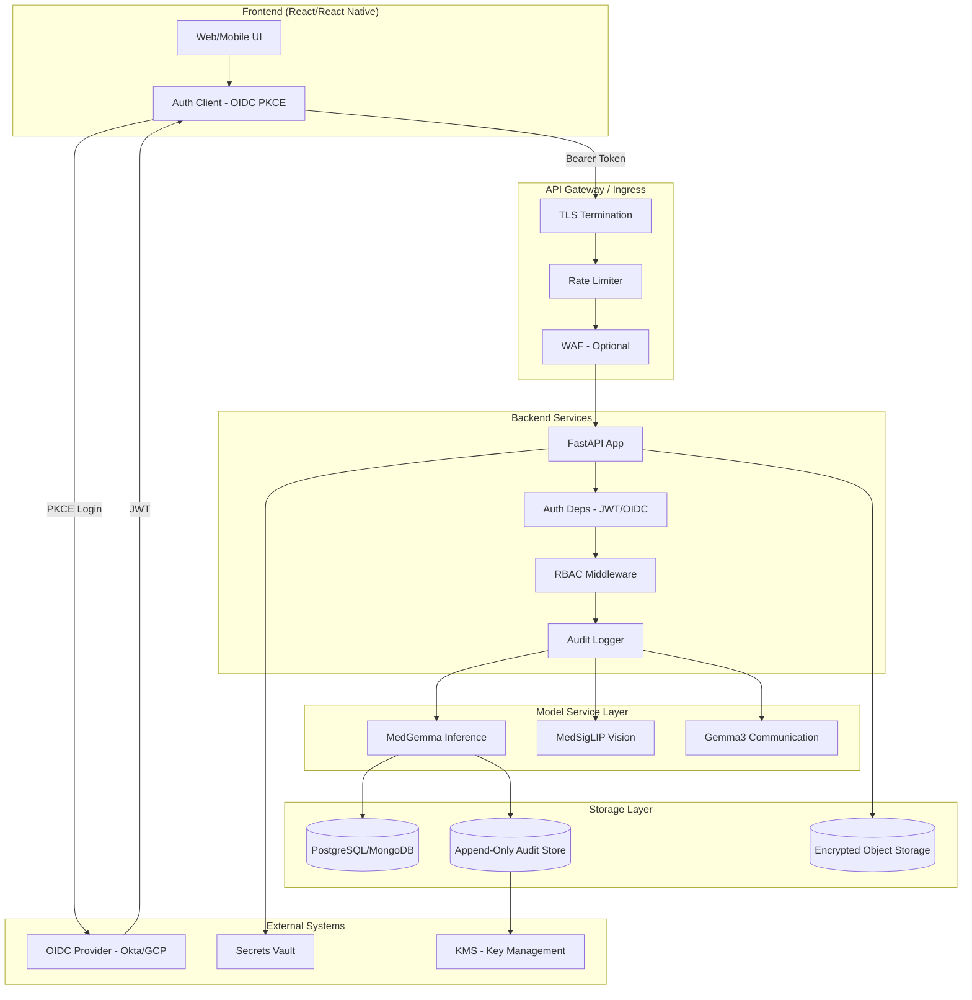

# Security Boundary & Architecture

## Overview

This document defines the security boundaries for PediScreen AI, mapping data flow from frontend through backend services to model inference and storage.

## Architecture Diagram

## Security Boundaries

| Boundary | Description | Controls |
|----------|-------------|----------|
| **Frontend → Gateway** | User requests enter via TLS. | TLS 1.3, HSTS, CSP headers |
| **Gateway → Backend** | Requests authenticated before processing. | JWT validation, rate limiting |
| **Backend → Auth** | Every sensitive request validated. | OIDC/JWT, MFA for clinician/admin |
| **Backend → RBAC** | Authorization enforced per endpoint. | Role→Permission mapping, least privilege |
| **Backend → Model** | Inference requests logged before execution. | Audit log, HMAC chain |
| **Backend → Storage** | PHI encrypted at rest. | KMS, access controls |
| **Audit Store** | Append-only, tamper-evident. | HMAC chaining, WORM retention |

## Data Flow for Inference

1. **Request**: Frontend sends `POST /api/analyze` with JWT + request body (observations, age, optional embeddings).
2. **Auth**: Middleware validates JWT, extracts `sub`, `roles`, `email`.
3. **RBAC**: Checks `infer_case` permission for user's role.
4. **Audit (pre)**: Computes `input_hash`, `prompt_hash`; creates audit entry stub.
5. **Inference**: MedGemma/MedSigLIP process; no raw PHI logged.
6. **Audit (post)**: Completes audit entry with `response`, `hmac`, appends to chain.
7. **Response**: Returns structured report; screening_id and inference_id for traceability.

## Trust Boundaries

- **Untrusted**: Client IP, user input (observations, images).
- **Semi-trusted**: OIDC provider (identity), frontend (token handling).
- **Trusted**: Backend services, model servers, audit store, KMS.

## See Also

- [sensitive_operations.csv](./sensitive_operations.csv) — Full inventory of sensitive operations
- [rbac.yml](./rbac.yml) — Role-permission mapping
- [log_storage.md](./log_storage.md) — Audit log storage and retention
